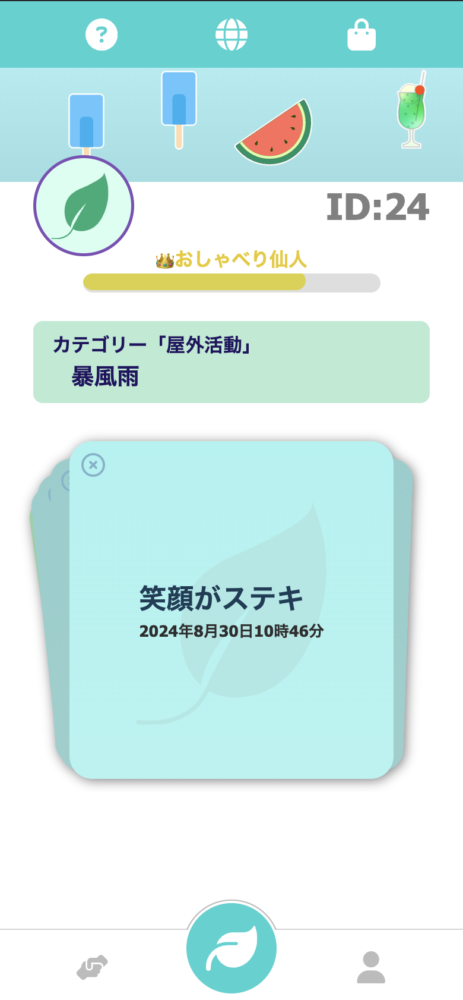

# さわやかコミュニケーション

新入社員が「さわやかポイント」を贈り合う承認欲求が満たせる交流アプリ

## 実行方法

DenoKV接続のため、.envファイルを作成します。

```.env
DENO_KV_ACCESS_TOKEN=
URL=
```

Denoコマンドで実行します。

`deno task start`

## アプリ

<https://sawa-communication.deno.dev/>


